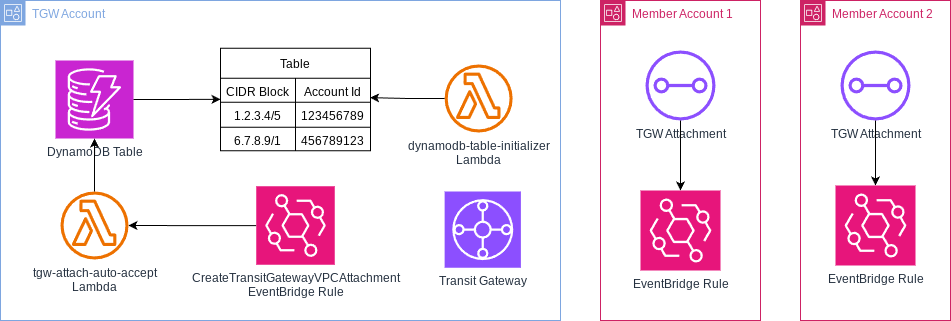

## AWS Automatically Accept Transit Gateway Attachments for allowed CIDR and Account pairs
This CloudFormation template deploys a solution to automatically accept Transit Gateway attachments by checking a centrally managed list of allowed CIDR and AccountId value pairs when using a centralized Transit Gateway. 
Prerequisite for this solution is the existence of a centralized Transit Gateway which is shared with all accounts via Resource Access Manager.

## Description

This solution uses a DynamoDB table to manage the list of allowed CIDR Blocks and Account Ids pairs. Using `cidr_block` as the primary key makes sure to not include the same CIDR Block multiple times in the Transit Gateway Attachments. As one account can include multiple VPCs with Transit Gateway attachments, setting it as the primary key wouldn't be suitable here. 

The values of the DynamoDB Table are set in the code in a Custom Resource which is used to initialize the DynamoDB Table. The Custom Resource executes a Lambda function during deployment or when the stack changes and creates the values for the DynamoDB Table which are documented in the code.

Also in every account an EventBridge Rule gets created which sends an event to the default base as soon as it captures the CloudTrail event `CreateTransitGatewayVpcAttachment`. The default bus of the corresponding account sends the event to the account where the Transit Gateway is created and triggers an Eventbridge Rule there which executes a Lambda Function. 
As well a cross-account Lambda Role gets created in every account to read-out the CIDR Block of the VPC mentioned in the event.

The Lambda function then checks if an entry for the provided CIDR Block and Account Id exists in the DynamoDB table and accepts the Attachment when a match is found. 

## Deployment

The solutions consists of two stacks.

The `tgw-attach-auto-accept-core.yaml` file needs to be created in the Account where the Transit Gateway is located.
The following resources will be created in the first stack:

- A DynamoDB Table for the entries of allowed CIDR Blocks and Account Ids. The CIDR Block functions as the primary key.
- A Custom Resources to initialize the DynamoDB Table entries and set the values. Every time the list of values in the Custom Resource gets updated, the Lambda Function will be executed again to update the DynamoDB Table.
- An Eventbridge Rule which receives the "CreateTransitGatewayVpcAttachment" event from the default bus and triggers the Lambda function to check and accept the attachment.
- A Lambda Function to check the source account which created the attachment, read out the DynamoDB table and if required accept the Transit Gateway Attachment (code in Github).

After that the `tgw-attach-auto-accept-global.yaml` needs to be executed in all accounts, deploying it as a Stackset is recommended. This will create the following resources:

- An Eventbridge Rule to capture `CreateTransitGatewayVpcAttachment` CloudTrail events from the specific accounts.
- A Cross-Account IAM Role to read-out the CIDR Block from the corresponding VPC which is given in the event

After the successful deployment and adding the relevant CIDR Block and Account Id pairs, you should be able to see the Transitgateway Attachment gets enabled automatically!
